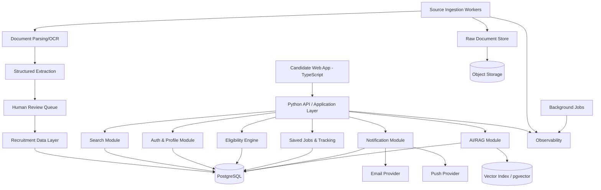
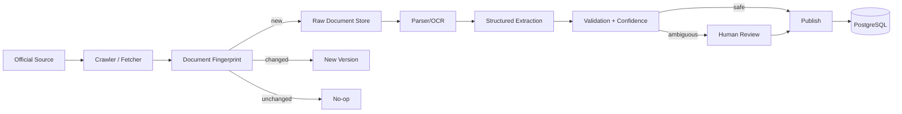
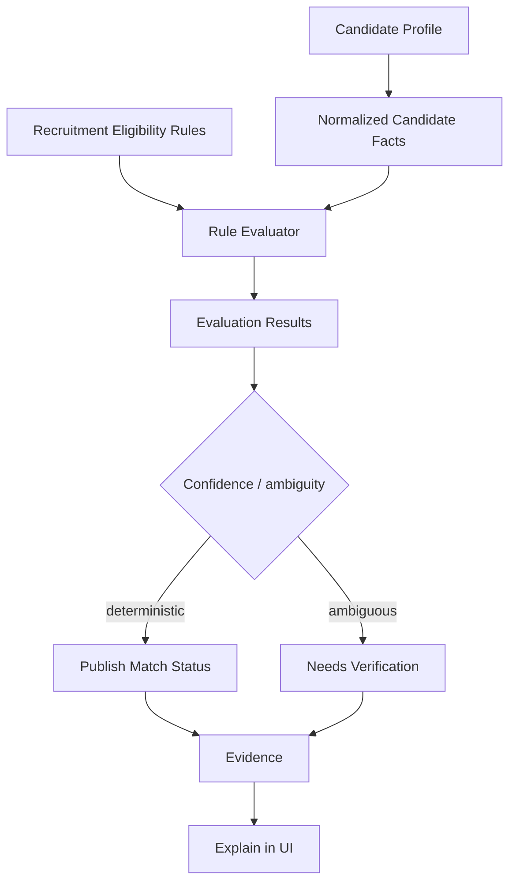

# Product Requirements Document (PRD)
# Government Jobs Intelligence & Eligibility Platform

**Document version:** 1.0  
**Status:** Build-ready MVP specification  
**Date:** 2026-10-03  
**Primary stack:** Python + PostgreSQL + TypeScript  
**Target deployment:** Cloud-native web application, India-first  
**Architecture style:** Modular monolith for MVP, designed for service extraction later

---

## 0. Executive Summary

### 0.1 Product vision

Build a trustworthy recruitment-intelligence platform that converts fragmented public recruitment notifications into structured, searchable, source-backed opportunities and explains eligibility to candidates.

The product is **not** an LLM-first job portal. The authoritative system of record is a versioned recruitment data layer. Deterministic business rules evaluate eligibility; AI is used for extraction assistance, document retrieval, summarization, and explanation.

### 0.2 Core value proposition

A candidate should be able to:

1. Create a profile once.
2. Discover relevant recruitment opportunities.
3. See why an opportunity matches or does not match.
4. Open the official notification/application source.
5. Track deadlines and saved opportunities.
6. Receive alerts when important recruitment information changes.

### 0.3 MVP scope

The MVP intentionally limits coverage to a controlled set of recruitment ecosystems rather than claiming nationwide completeness on day one.

**Initial source scope:**
- SSC
- UPSC
- IBPS
- RRB
- One state recruitment ecosystem selected during implementation planning

**MVP capabilities:**
- Recruitment-source ingestion
- PDF/web document storage and versioning
- Structured job/recruitment records
- Search and filtering
- Candidate profile
- Deterministic eligibility evaluation
- Evidence/provenance display
- Saved jobs
- Deadline reminders
- Basic notification/change detection
- Admin review queue
- Audit trail

**Deferred until data quality is proven:**
- Nationwide coverage
- 10+ language rollout
- Voice assistant
- WhatsApp integration
- Full application automation
- Advanced exam-preparation planner
- Sophisticated notification semantic diff
- Native mobile applications
- Broad private-sector aggregation

### 0.4 Product principles

1. **Official source first**
2. **Evidence before explanation**
3. **Deterministic eligibility before generative eligibility**
4. **Never hide uncertainty**
5. **Version recruitment information**
6. **Human review for high-impact ambiguity**
7. **Design for incremental source expansion**
8. **Accessibility by default**
9. **Privacy minimization**
10. **Observable and auditable operations**

---

# 1. System Architecture

## 1.1 Architecture overview

The MVP uses a modular monolith with clearly separated domain modules.



## 1.2 Logical layers

### Presentation layer
- TypeScript frontend
- Responsive web UI
- Accessibility-compliant components
- Server/API state management
- Authentication session handling

### API/application layer
- Python
- REST/JSON APIs
- Request validation
- Authentication/authorization
- Transaction orchestration
- Rate limiting
- API observability

### Domain layer

Modules:
- Identity & Candidate Profile
- Recruitment Catalog
- Source & Document Management
- Eligibility
- Search
- Saved Jobs
- Notifications
- AI/RAG
- Administration & Review
- Audit

### Data layer
- PostgreSQL as source of truth
- pgvector for semantic retrieval if required
- Object storage for PDFs/raw documents
- Redis-compatible cache/queue for background work

### Integration layer
- Government source websites
- Email provider
- Push provider
- Optional analytics
- LLM provider

---

## 1.3 Request flow: job discovery

```text
Candidate
  |
  v
Search UI
  |
  v
GET /v1/recruitments
  |
  v
API validation/auth
  |
  v
Search service
  |
  v
PostgreSQL indexes
  |
  v
Eligibility filter (optional)
  |
  v
Recruitment cards
  |
  v
Detail page
  |
  +--> Source evidence
  +--> Official notification
  +--> Eligibility explanation
  +--> Save / remind
```

## 1.4 Source ingestion flow



## 1.5 Eligibility evaluation flow



## 1.6 AI/RAG architecture

The LLM is never the authoritative eligibility engine.

```text
User question
  |
  v
Intent classification
  |
  v
Retrieve structured records + approved document chunks
  |
  v
Evidence filtering
  |
  v
LLM explanation
  |
  v
Citation/evidence attachment
  |
  v
Safety + hallucination checks
  |
  v
Response
```

AI must:
- cite the source document/page where available;
- distinguish extracted facts from interpretation;
- say when evidence is insufficient;
- never invent a deadline, qualification, age relaxation, vacancy or fee;
- never override deterministic eligibility results.

---

## 1.7 Deployment topology

Recommended MVP deployment:

```text
Internet
  |
CDN / WAF
  |
Load Balancer
  |
Python API containers
  |
  +---- PostgreSQL
  +---- Redis/Queue
  +---- Object Storage
  +---- pgvector
  |
Worker containers
  |
  +---- Crawlers
  +---- Parsers
  +---- Extraction
  +---- Notifications
```

Separate worker processes from API processes so crawling or PDF parsing cannot exhaust web request capacity.

---

## 1.8 Scalability strategy

Start as a modular monolith.

Extract services only when one of these thresholds is reached:
- ingestion jobs materially impact API latency;
- search workload needs independent scaling;
- AI workload requires separate GPU/compute controls;
- source ingestion teams need independent deployments.

Do not start with microservices unless operational requirements demand them.

---

# 2. Schema Design

## 2.1 Core entities

```text
User
  1:1 CandidateProfile

Organization
  1:N Recruitment

Recruitment
  1:N RecruitmentVersion

RecruitmentVersion
  1:N SourceDocument

Recruitment
  1:N JobPost

JobPost
  1:N EligibilityRule

User
  N:M Recruitment (SavedRecruitment)

User
  1:N Reminder

Recruitment
  1:N RecruitmentEvent

SourceDocument
  1:N DocumentChunk

RecruitmentVersion
  1:N ProvenanceRecord

All important entities
  1:N AuditLog
```

## 2.2 PostgreSQL design

### `users`

| Column | Type | Constraints |
|---|---|---|
| id | UUID | PK |
| email | CITEXT | UNIQUE, NOT NULL |
| password_hash | TEXT | NOT NULL if password auth |
| status | VARCHAR | NOT NULL |
| created_at | TIMESTAMPTZ | NOT NULL |
| updated_at | TIMESTAMPTZ | NOT NULL |

Indexes:
- unique(email)
- status
- created_at

### `candidate_profiles`

| Column | Type | Constraints |
|---|---|---|
| user_id | UUID | PK/FK users.id |
| date_of_birth | DATE | nullable |
| state_code | VARCHAR(10) | nullable |
| category_code | VARCHAR(30) | nullable |
| gender_code | VARCHAR(30) | nullable |
| disability_code | VARCHAR(50) | nullable |
| education_level | VARCHAR(50) | nullable |
| specialization_codes | JSONB | nullable |
| graduation_year | SMALLINT | nullable |
| experience_months | INTEGER | CHECK >= 0 |
| profile_version | INTEGER | NOT NULL |
| created_at | TIMESTAMPTZ | NOT NULL |
| updated_at | TIMESTAMPTZ | NOT NULL |

Sensitive profile attributes must be optional, purpose-limited, encrypted where appropriate, and excluded from logs.

### `organizations`

| Column | Type | Constraints |
|---|---|---|
| id | UUID | PK |
| name | TEXT | NOT NULL |
| short_name | TEXT | nullable |
| organization_type | VARCHAR(40) | NOT NULL |
| jurisdiction | VARCHAR(40) | NOT NULL |
| state_code | VARCHAR(10) | nullable |
| official_domain | TEXT | nullable |
| active | BOOLEAN | NOT NULL |
| created_at | TIMESTAMPTZ | NOT NULL |

### `source_endpoints`

Represents a monitored official source.

| Column | Type | Constraints |
|---|---|---|
| id | UUID | PK |
| organization_id | UUID | FK |
| url | TEXT | NOT NULL |
| endpoint_type | VARCHAR(30) | NOT NULL |
| crawl_frequency_minutes | INTEGER | NOT NULL |
| last_checked_at | TIMESTAMPTZ | nullable |
| last_success_at | TIMESTAMPTZ | nullable |
| health_status | VARCHAR(30) | NOT NULL |
| active | BOOLEAN | NOT NULL |

### `recruitments`

Logical recruitment campaign.

| Column | Type | Constraints |
|---|---|---|
| id | UUID | PK |
| organization_id | UUID | FK |
| title | TEXT | NOT NULL |
| recruitment_code | TEXT | nullable |
| status | VARCHAR(30) | NOT NULL |
| first_published_at | TIMESTAMPTZ | nullable |
| last_verified_at | TIMESTAMPTZ | nullable |
| created_at | TIMESTAMPTZ | NOT NULL |
| updated_at | TIMESTAMPTZ | NOT NULL |

### `recruitment_versions`

Immutable version of recruitment facts.

| Column | Type | Constraints |
|---|---|---|
| id | UUID | PK |
| recruitment_id | UUID | FK |
| version_number | INTEGER | NOT NULL |
| content_hash | CHAR(64) | NOT NULL |
| effective_from | TIMESTAMPTZ | nullable |
| extracted_at | TIMESTAMPTZ | NOT NULL |
| review_status | VARCHAR(30) | NOT NULL |
| extraction_confidence | NUMERIC(5,4) | CHECK 0..1 |
| published_at | TIMESTAMPTZ | nullable |

Unique:
- `(recruitment_id, version_number)`
- `(recruitment_id, content_hash)`

### `job_posts`

Represents a role/post within a recruitment.

| Column | Type | Constraints |
|---|---|---|
| id | UUID | PK |
| recruitment_id | UUID | FK |
| title | TEXT | NOT NULL |
| department | TEXT | nullable |
| job_type | VARCHAR(40) | nullable |
| location_text | TEXT | nullable |
| vacancy_count | INTEGER | nullable |
| pay_level | TEXT | nullable |
| min_age | SMALLINT | nullable |
| max_age | SMALLINT | nullable |
| application_start | TIMESTAMPTZ | nullable |
| application_deadline | TIMESTAMPTZ | nullable |
| official_apply_url | TEXT | nullable |
| official_notification_url | TEXT | nullable |
| current | BOOLEAN | NOT NULL |

Indexes:
- `(current, application_deadline)`
- `(title)`
- `(job_type)`
- `(department)`

### `eligibility_rules`

Each rule is a structured, deterministic rule.

| Column | Type | Constraints |
|---|---|---|
| id | UUID | PK |
| job_post_id | UUID | FK |
| rule_type | VARCHAR(40) | NOT NULL |
| operator | VARCHAR(30) | NOT NULL |
| rule_value | JSONB | NOT NULL |
| applies_to | JSONB | nullable |
| as_of_date | DATE | nullable |
| source_document_id | UUID | FK |
| source_page | INTEGER | nullable |
| confidence | NUMERIC(5,4) | NOT NULL |
| review_status | VARCHAR(30) | NOT NULL |

Examples:
- AGE_RANGE
- EDUCATION
- SPECIALIZATION
- EXPERIENCE
- DOMICILE
- CATEGORY_RELAXATION
- NATIONALITY
- PHYSICAL_STANDARD

### `source_documents`

| Column | Type | Constraints |
|---|---|---|
| id | UUID | PK |
| recruitment_version_id | UUID | FK |
| source_url | TEXT | NOT NULL |
| document_type | VARCHAR(30) | NOT NULL |
| title | TEXT | nullable |
| sha256 | CHAR(64) | NOT NULL |
| object_key | TEXT | NOT NULL |
| published_at | TIMESTAMPTZ | nullable |
| fetched_at | TIMESTAMPTZ | NOT NULL |
| page_count | INTEGER | nullable |
| mime_type | TEXT | NOT NULL |

### `document_chunks`

| Column | Type | Constraints |
|---|---|---|
| id | UUID | PK |
| source_document_id | UUID | FK |
| page_number | INTEGER | nullable |
| section_heading | TEXT | nullable |
| content | TEXT | NOT NULL |
| embedding | VECTOR | nullable |
| content_hash | CHAR(64) | NOT NULL |

Index:
- vector index if semantic retrieval is enabled.

### `provenance_records`

Field-level evidence.

| Column | Type | Constraints |
|---|---|---|
| id | UUID | PK |
| entity_type | VARCHAR(50) | NOT NULL |
| entity_id | UUID | NOT NULL |
| field_name | VARCHAR(100) | NOT NULL |
| source_document_id | UUID | FK |
| source_page | INTEGER | nullable |
| source_excerpt_hash | CHAR(64) | nullable |
| verification_status | VARCHAR(30) | NOT NULL |
| verified_by | UUID | nullable |
| verified_at | TIMESTAMPTZ | nullable |

### `eligibility_evaluations`

| Column | Type | Constraints |
|---|---|---|
| id | UUID | PK |
| user_id | UUID | FK |
| job_post_id | UUID | FK |
| profile_version | INTEGER | NOT NULL |
| result | VARCHAR(30) | NOT NULL |
| evaluated_at | TIMESTAMPTZ | NOT NULL |
| explanation JSONB | NOT NULL |
| engine_version | VARCHAR(30) | NOT NULL |

Possible results:
- MATCH
- LIKELY_MATCH
- NEEDS_VERIFICATION
- NOT_MATCH
- INSUFFICIENT_DATA

### `saved_recruitments`

Composite primary key:
- `user_id`
- `recruitment_id`

### `reminders`

| Column | Type |
|---|---|
| id | UUID PK |
| user_id | UUID FK |
| recruitment_id | UUID FK |
| event_type | VARCHAR(40) |
| scheduled_for | TIMESTAMPTZ |
| sent_at | TIMESTAMPTZ nullable |
| status | VARCHAR(30) |

### `recruitment_events`

Tracks lifecycle events.

Examples:
- PUBLISHED
- DEADLINE_CHANGED
- VACANCIES_CHANGED
- EXAM_DATE_CHANGED
- CORRIGENDUM
- APPLICATION_OPENED
- APPLICATION_CLOSED
- RESULT_PUBLISHED

### `audit_logs`

Immutable operational audit trail.

Fields:
- id
- actor_type
- actor_id
- action
- entity_type
- entity_id
- metadata
- request_id
- created_at

---

## 2.3 Database indexing strategy

Required indexes:

```sql
CREATE INDEX idx_recruitments_org_status
ON recruitments (organization_id, status);

CREATE INDEX idx_job_posts_deadline
ON job_posts (application_deadline)
WHERE current = TRUE;

CREATE INDEX idx_job_posts_title_search
ON job_posts USING GIN (to_tsvector('english', title));

CREATE INDEX idx_recruitment_versions_hash
ON recruitment_versions (recruitment_id, content_hash);

CREATE INDEX idx_eligibility_rules_job
ON eligibility_rules (job_post_id, rule_type);

CREATE INDEX idx_reminders_due
ON reminders (scheduled_for, status);

CREATE INDEX idx_source_docs_recruitment
ON source_documents (recruitment_version_id);
```

---

# 3. Tech Stack Specifications

## 3.1 Backend

**Language:** Python 3.12+  
**Framework:** FastAPI  
**ORM:** SQLAlchemy 2.x  
**Validation:** Pydantic v2  
**Migrations:** Alembic  
**Background jobs:** Celery/RQ/Arq-compatible worker architecture  
**HTTP client:** httpx  
**Parsing:** BeautifulSoup/lxml for HTML; PyMuPDF/pdfplumber for text PDFs; OCR only when necessary  
**Testing:** pytest

### Backend principles

- Type hints required
- Dependency injection for external services
- Repository/service boundaries
- Transaction boundaries explicit
- Idempotent ingestion jobs
- Structured JSON logging
- Correlation/request IDs

## 3.2 Database

**PostgreSQL 16+**

Optional:
- pgvector for semantic document retrieval
- PostgreSQL full-text search for MVP before introducing a separate search cluster

Do not introduce Elasticsearch/OpenSearch until PostgreSQL search becomes a measured bottleneck.

## 3.3 Frontend

**Language:** TypeScript  
**Framework:** React + Next.js  
**Styling:** Tailwind CSS or equivalent design system  
**Forms:** React Hook Form + schema validation  
**Data fetching:** TanStack Query  
**Testing:** Playwright + Vitest

## 3.4 Infrastructure

Recommended:
- Docker
- Managed PostgreSQL
- Managed object storage
- Redis-compatible queue/cache
- CDN/WAF
- Secret manager
- Centralized logs
- Metrics and tracing

## 3.5 AI

LLM provider must be abstracted behind an internal interface.

```python
class LLMProvider(Protocol):
    async def generate(self, request: LLMRequest) -> LLMResponse: ...
```

This prevents provider lock-in.

AI use cases:
- document classification
- extraction assistance
- summarization
- RAG question answering
- multilingual explanation

AI must not directly mutate authoritative recruitment facts without validation/review.

---

# 4. Module Logical Interpretation

## 4.1 Source Management Module

### Purpose
Maintain a controlled registry of official recruitment sources.

### Requirements
- Register source endpoint.
- Schedule checks.
- Fetch documents.
- Compute SHA-256.
- Detect unchanged content.
- Store every changed document as a new version.
- Record HTTP metadata.
- Record crawl health.
- Prevent duplicate publication.

### Business rules
1. Official source has highest authority.
2. Same content hash must be idempotent.
3. Failed fetch must not delete existing valid data.
4. A changed document must not overwrite historical versions.
5. Source outages must be observable.

---

## 4.2 Document Processing Module

### Workflow

```text
Document
→ MIME detection
→ text extraction
→ OCR fallback
→ page segmentation
→ section detection
→ extraction
→ schema validation
→ confidence calculation
→ review
```

### Requirements
- Preserve original file.
- Preserve page numbers.
- Detect scanned PDFs.
- Store parser version.
- Store extraction timestamp.
- Reject unsupported/corrupt documents gracefully.

### Confidence
Low-confidence extraction must enter review rather than silently publishing.

---

## 4.3 Recruitment Normalization Module

### Purpose
Convert inconsistent source language into a common canonical model.

Examples:

```text
"Last date for submission"
"Closing date"
"Application closes on"
"Applications accepted till"

→ application_deadline
```

Canonical enums should be stable and versioned.

---

## 4.4 Eligibility Engine

### Input

```json
{
  "candidate": {
    "date_of_birth": "2003-05-10",
    "education_level": "BACHELOR",
    "specializations": ["COMPUTER_SCIENCE"],
    "experience_months": 0
  },
  "job_post_id": "..."
}
```

### Output

```json
{
  "result": "LIKELY_MATCH",
  "reasons": [
    {
      "rule": "EDUCATION",
      "status": "PASS"
    },
    {
      "rule": "AGE",
      "status": "PASS"
    },
    {
      "rule": "SPECIALIZATION",
      "status": "NEEDS_VERIFICATION"
    }
  ]
}
```

### Evaluation rules

1. Missing candidate information must not be interpreted as false.
2. Ambiguous source rules become `NEEDS_VERIFICATION`.
3. Age must use the notification's specified reference date.
4. Relaxation rules must be evaluated only when their applicability is explicitly supported.
5. Every result must retain the engine version and source evidence.
6. Candidate-visible claims must distinguish deterministic facts from interpretation.

---

## 4.5 Search Module

### Filters
- organization
- recruitment type
- role
- education
- state/location
- deadline
- age
- experience
- application status
- eligibility result

### Search behavior
- typo-tolerant where practical
- synonym mapping
- exact official title preserved
- pagination required
- stable sorting

Default sort:
1. active/open applications
2. nearest deadline
3. verified freshness

Do not claim a ranking as "best"; rankings should be relevance/recency based and transparently labeled.

---

## 4.6 Candidate Profile Module

### Profile fields
- age/date of birth
- education
- specialization
- graduation year
- experience
- location/state
- optional category-related eligibility attributes

### Requirements
- progressive completion
- field-level privacy controls
- edit history
- profile versioning
- re-evaluate saved jobs when profile changes

---

## 4.7 Saved Jobs & Application Tracking

### Features
- save/unsave
- notes
- application status
- custom reminder
- deadline reminder
- status timeline

### Statuses
- SAVED
- PLANNING
- APPLIED
- EXAM_SCHEDULED
- EXAM_COMPLETED
- RESULT_WAITING
- SELECTED
- NOT_SELECTED
- CLOSED

---

## 4.8 Notification Module

### Channels
- in-app
- email
- push later

### Notification priorities
- deadline approaching
- deadline changed
- exam date changed
- corrigendum
- eligibility-impacting change

### Anti-spam
- deduplicate equivalent events
- per-user notification preferences
- daily notification cap
- quiet hours

---

## 4.9 Change Detection Module

### MVP
Detect:
- new notification
- changed PDF hash
- changed deadline
- changed vacancy count
- changed application window

### Future
Semantic document diff.

### Safety rule
Never infer "eligibility changed" solely from a document hash. Re-run structured rules and compare results.

---

## 4.10 Admin Review Module

### Queue types
- low-confidence extraction
- conflicting source data
- failed parser
- broken source
- user-reported error
- ambiguous eligibility

### Reviewer actions
- approve
- reject
- edit
- defer
- mark source unavailable

Every reviewer mutation must create an audit event.

---

## 4.11 AI Copilot Module

### MVP behavior
The assistant can answer:
- "What is the last date?"
- "What qualifications are required?"
- "Why does this job appear in my matches?"
- "What documents are required?"

### Answer contract

Every factual answer should include:
- source title
- page/section when available
- last verified timestamp
- uncertainty statement when applicable

### Refusal behavior
If evidence cannot support an answer:

> "I couldn't verify that from the available official source."

Do not fill gaps with model memory.

---

# 5. API Requirements

## 5.1 Authentication

```http
POST /v1/auth/register
POST /v1/auth/login
POST /v1/auth/logout
POST /v1/auth/refresh
```

## 5.2 Profile

```http
GET /v1/profile
PUT /v1/profile
GET /v1/profile/evaluations
```

## 5.3 Recruitment

```http
GET /v1/recruitments
GET /v1/recruitments/{id}
GET /v1/recruitments/{id}/sources
GET /v1/recruitments/{id}/events
```

## 5.4 Eligibility

```http
POST /v1/eligibility/evaluate
GET /v1/recruitments/{id}/eligibility
```

## 5.5 Saved jobs

```http
POST /v1/recruitments/{id}/save
DELETE /v1/recruitments/{id}/save
GET /v1/saved
```

## 5.6 Reminders

```http
POST /v1/reminders
DELETE /v1/reminders/{id}
GET /v1/reminders
```

## 5.7 AI

```http
POST /v1/assistant/query
```

The assistant endpoint must return structured citations/evidence IDs alongside generated text.

---

# 6. UI & UX Instructions

## 6.1 Design language

The interface should feel:
- trustworthy
- calm
- information-dense but not cluttered
- mobile-friendly
- accessible
- transparent about uncertainty

Avoid:
- aggressive gamification
- misleading "guaranteed eligibility" language
- unnecessary dark patterns
- excessive advertising
- fake urgency

## 6.2 Primary navigation

Desktop:

```text
Logo | Explore Jobs | My Matches | Saved | Calendar | Profile
```

Mobile:
- Home
- Search
- Matches
- Saved
- Profile

## 6.3 Home page

Sections:
1. Search
2. Recommended matches
3. Deadlines
4. Recently updated recruitments
5. Source verification information

## 6.4 Recruitment card

Must show:
- official organization
- role title
- deadline
- vacancy if verified
- eligibility status if profile exists
- last verified timestamp
- Save action

Example:

```text
SSC — Recruitment Title
Junior ...
Deadline: 18 Oct 2026
Eligibility: Likely match
Last verified: 14:35 IST
[View details] [Save]
```

## 6.5 Detail page

Order:

1. Summary
2. Key dates
3. Eligibility
4. Vacancy/pay information
5. Selection process
6. Application process
7. Documents
8. Official sources
9. Change history
10. Report an issue

## 6.6 Eligibility UI

Never show only a green/red result.

Show:

```text
Likely match

✓ Age requirement
✓ Education
✓ Experience
⚠ Specialization requires verification

Why?
[Expand evidence]
```

## 6.7 Accessibility

Target WCAG 2.1 AA practices:
- keyboard navigation
- visible focus
- semantic HTML
- sufficient contrast
- accessible forms
- error messages linked to inputs
- no information conveyed by color alone
- scalable text
- reduced-motion support
- screen-reader labels

## 6.8 Responsive behavior

Breakpoints should support:
- mobile-first
- tablet
- desktop

Tables must transform into cards or horizontally scroll without losing critical fields.

---

# 7. Guardrails & Constraints

## 7.1 Security

Use:
- TLS everywhere
- secure cookies
- CSRF protection where cookie auth is used
- password hashing with Argon2id
- short-lived access tokens
- refresh-token rotation
- RBAC for admin/reviewer roles
- secrets manager
- dependency vulnerability scanning
- audit logs

Never store:
- plaintext passwords
- unnecessary government ID numbers
- full sensitive documents unless a clearly defined feature requires them

## 7.2 Input validation

All API inputs validated with Pydantic.

Examples:
- email normalization
- URL scheme allowlist
- integer bounds
- date sanity checks
- enum validation
- maximum text length
- JSON depth/size limits

Reject:
- executable uploads
- unsupported MIME types
- oversized files
- malformed payloads

## 7.3 File security

For uploaded files:
- verify MIME type from content, not extension alone
- virus/malware scan
- enforce size limit
- store outside executable paths
- randomize object keys
- never execute uploaded files
- signed temporary download URLs

## 7.4 Rate limiting

Suggested initial limits:

| Endpoint type | Limit |
|---|---:|
| Public search | 60/min/IP |
| Auth login | 10/min/IP |
| Profile writes | 30/min/user |
| Eligibility evaluation | 30/min/user |
| AI assistant | 20/min/user |
| Admin APIs | 120/min/user |

Limits must be configurable.

## 7.5 AI guardrails

The assistant must:
- retrieve approved evidence first;
- never invent source citations;
- never fabricate application URLs;
- never state uncertain eligibility as confirmed;
- never expose internal prompts or secrets;
- never access another user's profile;
- enforce output length;
- log model/version metadata without storing unnecessary sensitive content.

## 7.6 Data integrity

- Immutable recruitment versions
- Transactional publishing
- Idempotent ingestion
- Unique content hashes
- Foreign key constraints
- Check constraints for numeric fields
- Soft-disable rather than destructive deletion for authoritative recruitment records

## 7.7 Error handling

Client:
- human-readable message
- stable error code
- retry guidance where appropriate

Server:
```json
{
  "error": {
    "code": "RECRUITMENT_SOURCE_UNAVAILABLE",
    "message": "The official source could not be verified right now.",
    "request_id": "..."
  }
}
```

Do not expose stack traces.

## 7.8 Performance targets

Initial targets:

- p95 API read latency: < 500 ms excluding external providers
- p95 search latency: < 700 ms
- p95 recruitment detail: < 500 ms
- background ingestion isolated from API
- 99.5% monthly MVP API availability target
- database backups automated
- RPO <= 24 hours
- RTO <= 4 hours

Targets must be load-tested before production commitments.

---

# 8. Data Quality & Trust Model

## 8.1 Source authority

```text
OFFICIAL
OFFICIAL_AGGREGATOR
SECONDARY
UNVERIFIED
```

Only official sources should be used as authoritative evidence for recruitment facts.

## 8.2 Data confidence

```text
VERIFIED
HIGH_CONFIDENCE
NEEDS_REVIEW
STALE
CONFLICTING
```

These are independent of source authority.

## 8.3 Field provenance

Every high-impact field should be traceable to:
- document
- page
- section
- extraction version
- verification status
- verifier where applicable

## 8.4 High-impact fields

Require stronger validation:
- application deadline
- application opening date
- vacancy count
- age limits
- qualification
- specialization
- experience
- fee
- exam date
- official apply URL

---

# 9. Observability & Operations

## 9.1 Metrics

Track:
- crawl success rate
- source freshness
- parser failure rate
- extraction confidence
- review backlog
- publication latency
- API latency
- error rate
- eligibility evaluation latency
- notification delivery rate
- AI citation coverage
- user-reported data errors

## 9.2 Alerts

Alert on:
- source unavailable for configured threshold
- sudden drop in ingestion
- parser failure spike
- database connection exhaustion
- queue backlog
- notification delivery failure
- AI provider error spike

## 9.3 Operational dashboard

Admin dashboard should show:

```text
Sources healthy:  4/5
Documents today:  87
Needs review:     13
Failed parses:     2
Stale sources:     1
Notifications:   342
```

---

# 10. Testing Strategy

## 10.1 Unit tests

Required for:
- eligibility rules
- age calculation
- date reference logic
- relaxation logic
- normalization
- notification deduplication
- versioning
- URL validation

## 10.2 Integration tests

- PostgreSQL transactions
- ingestion pipeline
- document storage
- API authentication
- notification provider
- search

## 10.3 Contract tests

Validate:
- government source adapters
- LLM provider interface
- notification provider interface

## 10.4 End-to-end tests

Critical journey:

```text
Register
→ Complete profile
→ Search
→ Open job
→ See eligibility
→ Save
→ Create reminder
→ Receive change/deadline event
```

## 10.5 Data-quality test suite

Maintain a golden dataset of manually verified recruitment notifications.

Every parser/extractor change must run against it.

---

# 11. MVP Acceptance Criteria

The MVP is release-ready when:

### Data
- configured sources can be monitored automatically;
- unchanged documents are not duplicated;
- changed documents create versions;
- high-impact fields have provenance;
- review queue is operational.

### Eligibility
- age calculations use notification reference dates;
- missing data produces uncertainty, not false rejection;
- results are explainable;
- engine version is retained.

### Search
- users can filter active recruitments;
- deadlines are searchable;
- detail pages expose official sources.

### Trust
- every high-impact fact displays verification status;
- official application links are directly accessible;
- stale/conflicting information is visibly marked.

### Security
- authentication and authorization tested;
- rate limits enabled;
- uploaded files scanned;
- secrets not committed;
- audit logs enabled for privileged actions.

### Performance
- agreed p95 targets met under load test;
- worker failures do not take down API;
- database backups verified by restore test.

---

# 12. Non-Functional Requirements

| Category | MVP Requirement |
|---|---|
| Availability | 99.5% monthly target |
| API p95 | <500 ms for normal reads |
| Search p95 | <700 ms |
| Security | OWASP-aligned controls |
| Accessibility | WCAG 2.1 AA target |
| Auditability | All admin data mutations logged |
| Data retention | Defined per data class |
| Backup | Automated + restore-tested |
| Privacy | Data minimization |
| Scalability | Horizontal API/worker scaling |
| Observability | Logs, metrics, traces |

---

# 13. Roadmap

## Phase 0 — Validation
**2–3 weeks**
- manually structure ~100 notifications
- test eligibility UX
- interview/test with candidates
- establish source taxonomy

## Phase 1 — MVP
**6–8 weeks**
- controlled source ingestion
- recruitment database
- search
- candidate profile
- eligibility engine
- provenance
- saved jobs
- reminders
- admin review

## Phase 2 — Reliability
**6–8 weeks**
- source expansion
- stronger change detection
- calendar
- application tracker
- source health
- improved notifications

## Phase 3 — AI
**6–8 weeks**
- RAG
- cited assistant
- multilingual explanations
- document Q&A
- change explanations

## Phase 4 — Scale
**6+ months**
- state expansion
- broader public-sector coverage
- mobile applications
- advanced personalization
- monetization experiments

---

# 14. Risks & Mitigations

| Risk | Impact | Mitigation |
|---|---|---|
| Incorrect extracted eligibility | Critical | Deterministic rules + review |
| Government source changes | High | Versioning + health monitoring |
| PDF parsing failure | High | OCR fallback + review |
| Stale information | Critical | Freshness timestamp + source monitoring |
| AI hallucination | Critical | RAG + citations + structured facts |
| Scope explosion | High | Controlled source expansion |
| Notification spam | Medium | Deduplication + preferences |
| Privacy leakage | Critical | Data minimization + RBAC |
| Vendor lock-in | Medium | Provider abstraction |
| Search scaling | Medium | PostgreSQL first, separate search later |

---

# 15. Product Success Metrics

Do not optimize only for raw user count.

### Trust
- % high-impact fields with valid provenance
- source freshness
- user-reported error rate
- correction resolution time

### Utility
- search-to-detail conversion
- detail-to-save conversion
- profile completion
- eligibility evaluation usage
- reminder creation

### Reliability
- ingestion success
- parser success
- review turnaround
- notification delivery

### AI quality
- citation coverage
- grounded-answer rate
- unsupported-claim rate
- user correction rate

---

# 16. Architectural Decision Records

## ADR-001: Modular monolith for MVP

**Decision:** Use a modular monolith.

**Reason:** Lower operational complexity while preserving clear boundaries.

**Rejected:** Full microservices from day one.

## ADR-002: PostgreSQL as initial search database

**Decision:** Use PostgreSQL + full-text search initially.

**Reason:** Reduces infrastructure and keeps recruitment data transactional.

**Rejected:** Elasticsearch/OpenSearch at MVP without measured need.

## ADR-003: Deterministic eligibility engine

**Decision:** Eligibility is rule-based and evidence-backed.

**Reason:** Eligibility errors are high-impact.

**Rejected:** LLM-only eligibility.

## ADR-004: Versioned recruitment data

**Decision:** Recruitment versions are immutable.

**Reason:** Enables auditability, corrections, and future change detection.

## ADR-005: AI as explanation layer

**Decision:** AI explains retrieved facts; it does not become the system of record.

**Reason:** Prevents hallucinated recruitment facts.

---

# 17. Recommended Repository Structure

```text
govjobs/
├── apps/
│   ├── api/
│   │   ├── app/
│   │   │   ├── api/
│   │   │   ├── core/
│   │   │   ├── domains/
│   │   │   │   ├── auth/
│   │   │   │   ├── profiles/
│   │   │   │   ├── recruitments/
│   │   │   │   ├── eligibility/
│   │   │   │   ├── notifications/
│   │   │   │   ├── assistant/
│   │   │   │   └── admin/
│   │   │   ├── infrastructure/
│   │   │   └── main.py
│   │   └── tests/
│   ├── workers/
│   │   ├── crawlers/
│   │   ├── parsers/
│   │   ├── extractors/
│   │   └── jobs/
│   └── web/
│       ├── app/
│       ├── components/
│       ├── features/
│       └── tests/
├── packages/
│   ├── schemas/
│   └── shared/
├── infra/
│   ├── docker/
│   ├── terraform/
│   └── monitoring/
├── migrations/
├── docs/
├── scripts/
└── README.md
```

---

# 18. Definition of Done

A feature is done only when:

- acceptance criteria are met;
- unit tests exist;
- integration tests exist where applicable;
- authorization is tested;
- observability is implemented;
- failure behavior is defined;
- documentation is updated;
- accessibility is reviewed;
- source/provenance requirements are satisfied for data features.

---

# 19. Final Architecture Position

The recommended product architecture is:

```text
                ┌──────────────────────┐
                │ TypeScript Web App   │
                └──────────┬───────────┘
                           │
                    REST / JSON API
                           │
                ┌──────────▼───────────┐
                │ Python Application   │
                │ Modular Monolith     │
                └──────────┬───────────┘
                           │
        ┌──────────────────┼──────────────────┐
        │                  │                  │
        ▼                  ▼                  ▼
 Recruitment           Eligibility          User
 Data Layer              Engine            Services
        │                  │                  │
        └──────────────────┼──────────────────┘
                           ▼
                    PostgreSQL
                           │
          ┌────────────────┼────────────────┐
          ▼                ▼                ▼
      Documents         pgvector        Audit/Events
          │
          ▼
      AI / RAG
          │
          ▼
   Evidence-backed answers
```

The central architectural principle is:

> **Recruitment data is authoritative; rules determine eligibility; AI explains evidence.**

That principle should remain intact as the product scales from a controlled MVP to broader Indian recruitment coverage.
